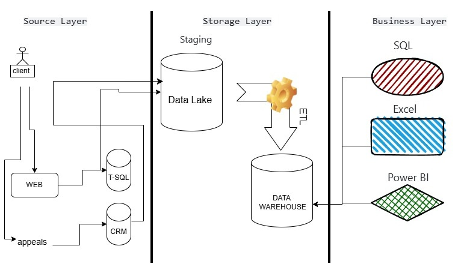

# Practice: Analytical Solution Architecture

## Task

Design a **high-level architecture for an analytical solution** for your company.

The architecture should demonstrate the main components of the analytical platform and how data flows between them.

## Requirements

- Create a high-level analytical solution architecture.
- Show the main data sources, data processing components, storage, and analytics/visualization layers.
- Illustrate the main data flows between components.
- Keep the architecture at a high level without going into implementation details.
- Create the architecture diagram using **draw.io**.

## Deliverable

A high-level architecture diagram representing the analytical solution for the company.

**Tool:** [draw.io](https://app.diagrams.net/)
## Architecture Diagram

